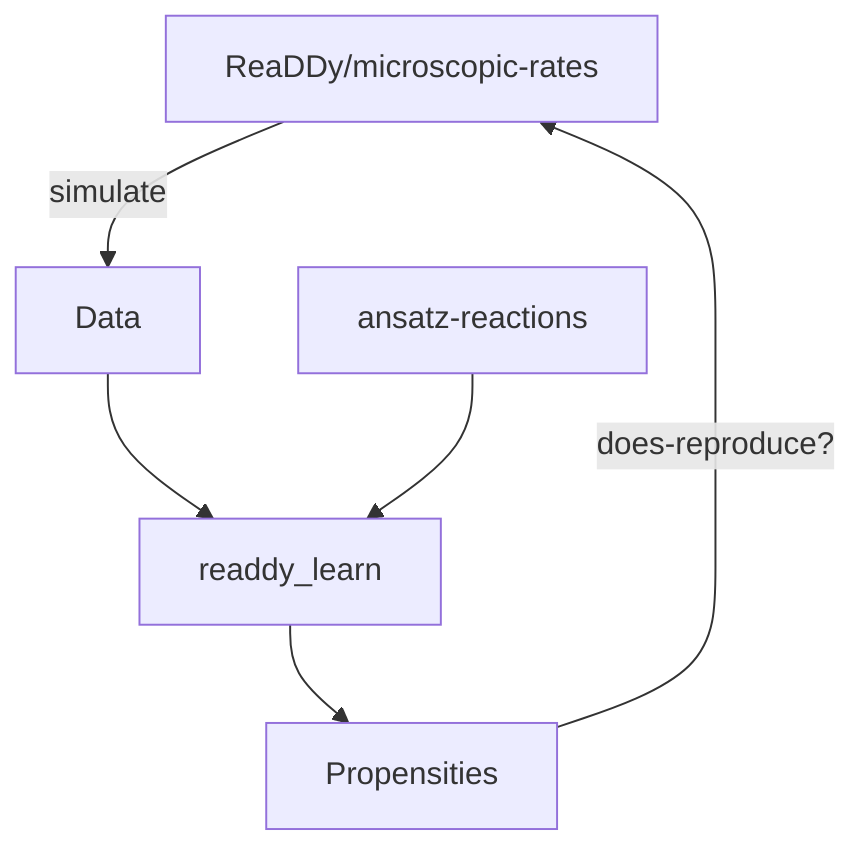

Recovering model from RD-data. TOC:

[[toc]]

# Goals
- Which reactions?
- Which rates corresponding to the reactions?
- Which diffusion constants?

# Ideas/Todos:
- [ ] Discretize space into (small) boxes, thus find small fluctuations in concentration
- [x] Fit the data onto a model with all possible reactions, penalizing small values (rates etc)
- [ ] Find propagator $$x_{t+\tau} = \mathcal{T}(\tau)\circ x_t$$

__Koopman:__ $$\mathcal{K}:\mathcal{F}\to\mathcal{F}, \phi\mapsto\phi\circ F$$, where $$\dot x = F(x)$$. With $$g(\mathbf{x})=\mathbf{x}$$ one obtains
$$$
F(x) = (\mathcal{K}g)(x) = \sum \mathbf{v}_k(\mathcal{K}\varphi_k)(x) = \sum_k \mu_k\mathbf{v}_k\varphi_k(x),
$$$
where $$v_k, \varphi_k, \mu_k$$ are the modes, eigenfunctions and eigenvalues, respectively. Estimate Koopman operator via EDMD, then recover generator $$\mathcal{L}$$ by estimating rates.
$$$
\mathcal{T}=\exp(\tau\mathcal{L})
$$$

__Validation:__

# Papers

## Discovering governing equations from data by sparse identification of nonlinear dynamical systems 
- _goal_: discover governing equations from noisy measurement data
- combine sparsity-promoting techniques and machine learning with nonlinear dynamical systems
- use sparse regression

_SINDy_: Sparse identification of nonlinear dynamics
$$$
\frac{\mathrm{d}\mathbf{x(t)}}{\mathrm{d}t} = \mathbf{f}(\mathbf{x(t)})
$$$
- the function $$\mathbf{f}$$ usually only consists of a few terms, i.e., sparse in the space of possible functions
- to determine $$\mathbf{f}$$, collect a time history of the state $$\mathbf{x}(t)$$ and either measure $$\dot{\mathbf{x}}(t)$$ or approximate it numerically - the sample $$t_1, t_2, \ldots, t_m$$ and arrange it into matrices

$$$
\mathbf{X} = \begin{pmatrix}\mathbf{x}^T(t_1) \\ \vdots \\ \mathbf{x}^T(t_m)\end{pmatrix} = \begin{pmatrix} x_1(t_1) & \cdots & x_n(t_1)\\ \vdots & \vdots & \vdots \\ x_1(t_m) & \cdots & x_n(t_m) \end{pmatrix},\quad \dot{\mathbf{X}} = \begin{pmatrix}\dot\mathbf{x}^T(t_1) \\ \vdots \\ \dot\mathbf{x}^T(t_m)\end{pmatrix}
$$$

- construct a library $$\Theta(\mathbf{X})$$ of candidate functions of the columns of $$\mathbf{X}$$ - example:

$$$
\Theta(\mathbf{X}) = \begin{pmatrix} 1 & \mathbf{X} & \mathbf{X}^{P_2} & \cdots & \sin(\mathbf{X}) & \cos(\mathbf{X}) & \cdots \end{pmatrix},
$$$
where each function acts on the columns of $$\mathbf{X}$$.

# Reaction-kinetics in a single box / concentrations
## ODE formulation
There are $$S$$ particle species. The concentration of them at a fixed time is in a vector $$\mathbf{x}\in\mathbb{R}^S$$

$$$
\mathbf{x}(t) = \begin{pmatrix}x_1(t) \\ \vdots \\ x_S(t) \end{pmatrix}
$$$
The change of species $$i\in [1,S]$$ yields a system of ODEs
$$$
\dot{x_i}(t) 
= \sum_{r=1}^R \theta_{r,i}(\mathbf{x}(t))\,\xi_r
$$$
where $$\theta_{r,i}(\mathbf{x}(t))$$ is the amount that species $$i$$ gains in a reaction $$r$$.This depends on the current state of the system. Each function $$\theta_r(\mathbf{x}(t))$$ represents one reaction of the system. $$\xi_r$$ is the propensity for the $$r$$-th reaction.

__Example:__ $$A+B\rightarrow C$$ and $$C\rightarrow A$$ with macroscopic rates $$\xi_1$$ and $$\xi_2$$ respectively
$$$
\mathbf{\dot{x}}(t) 
= \begin{pmatrix}\dot{x}_A(t) \\ \dot{x}_B(t) \\ \dot{x}_C(t) \end{pmatrix}
= \begin{pmatrix}
  -x_A(t)x_B(t) & x_C(t)\\
  -x_A(t)x_B(t) &  0 \\ 
  x_A(t)x_B(t) & -x_C(t)
  \end{pmatrix}
  \begin{pmatrix} \xi_1 \\ \xi_2 \end{pmatrix}
$$$

## Learn propensities from data
Use the functions $$\theta_r$$ as ansatz-functions for a minimization problem. Formulate the problem in terms of data. Let $$\mathbf{X}\in\mathbb{R}^{T\times S}$$ be the concentrations of particles per time and per species. There are $$T$$ timesteps and $$S$$ species. The time-derivative $$\mathbf{\dot{X}}\in\mathbb{R}^{T\times S}$$ has to be approximated.

We propose $$R$$ ansatz functions, each $$\theta_r(.)$$ representing a reaction with propensity $$\xi_r$$. Then we can formulate $$\Theta(\mathbf{X})\in\mathbb{R}^{T\times S\times R}$$ as a data-tensor and the corresponding propensities as a vector $$\Xi\in\mathbb{R}^R$$. We can reformulate the reaction-kinetics ODEs in a discrete form
$$$
\mathbf{\dot{X}} = \Theta(\mathbf{X})\,\Xi
$$$

### Minimize matrix norm with l1 penalty
We want to find the propensities $$\hat{\Xi}$$ that minimize the residual in the above equation with respect to a Frobenius norm. We enforce sparsity in the reactions that generate the system by introducing an L1 penalty term with the hyperparameter $$\alpha$$.
$$$
\begin{aligned}
  \hat{\Xi} &= \mathrm{argmin}_{\Xi}\left(\sum_{t=1}^{T}\sum_{s=1}^{S} \left\lVert \dot{X}_{t,s} - \sum_{r=1}^{R}\Theta(\mathbf{X})_{t,s,r} \right\rVert^2 + \alpha\lVert\Xi\rVert_1\right) \\\\
  \hat{\Xi} &= \mathrm{argmin}_{\Xi}\left(
    \left\lVert \mathbf{\dot{X}} - \Theta(\mathbf{X})\Xi \right\rVert^2_F 
    + \alpha\lVert\Xi\rVert_1
  \right)
\end{aligned}
$$$

__Simon:__ Consider averaging over multiple realisations and consider fiting time-correlations

__Insert example image here: Reproducing the ODE behavior (probablity overfitted)__

### Cross validation
Aim is to find the hyperparameter $$\hat{\alpha}$$ that produces best fits without overfitting the noise. The procedure is:
- Aquire two datasets: training- and test-set, $$(\mathbf{\dot{X}}_\mathrm{train},\Theta(\mathbf{X})_\mathrm{train})$$ and $$(\mathbf{\dot{X}}_\mathrm{test},\Theta(\mathbf{X})_\mathrm{test})$$ respectively, either by splitting one time-series or having two independent realisations
- For a given set of $$\alpha_i$$ solve the minimization on the training set to find the corresponding $$\hat{\Xi}_i$$
- For each $$\hat{\Xi}_i$$, calculate the cost function/residual for the test set  $$E_{\mathrm{test},i} = \left\lVert \mathbf{\dot{X}}_\mathrm{test} - \Theta(\mathbf{X})_\mathrm{test}\hat{\Xi}_i \right\rVert^2_F$$

The scale of the optimal hyperparameter $$\hat{\alpha}$$ can be approximated. For values large enough (roughly $$\alpha_0$$) the L1 penalty term dominates and the cost function saturates
$$$
\alpha_\mathrm{0} \left\lVert\hat{\Xi}\right\rVert_1 \approx \left\lVert
\mathbf{\dot{X}}_\mathrm{train} 
- \Theta(\mathbf{X})_\mathrm{train}\hat{\Xi}(\alpha=0)
\right\rVert^2_F
$$$
Let $$\omega = \lfloor\log_{10}\alpha_0\rfloor$$ be the order of magnitude of $$\alpha_0$$, then the search grid for finding the optimal hyperparameter $$\hat\alpha$$ is spanned over the interval $$[0, 10^{\omega+1}]$$.

# Include spatial information - diffusion
The space is discretized into $$m$$ pairwise disjoint boxes $$\Omega = \bigcup_{i=1}^m Q_i$$. The boxes should be chosen such that there is usually only one reaction at a time (so rather small). 

## For one box containing three species with occasional reactions
We have $$m=1$$, $$N=3$$ species and a corresponding ("continuous") trajectory
$$$
\mathbf{x}(t) = \left(A_i(t)\right)_{i=1}^N\in\mathbb{R}^N,
$$$
where $$A_i(t)$$ is the number of particles of species $$i$$ at time $$t$$ and a simulation time step of $$\Delta t$$.

Discretizing the trajectory: We have for the present species a set of possible reactions (unary and binary). By comparing $$\mathbf{x}(t)$$ and $$\mathbf{x}(t-\Delta t)$$ one can figure out the reaction (and thus the state) that has happened in the particular box.

This yields a discrete trajectory $$t\mapsto S(t)$$. In the case of multiple boxes we get multiple of these discrete trajectories plus diffusive reactions, as in one particle disappears in one box and appears out of nowhere in the other box.

- (i dont know about this) These discrete trajs can now be aggregated (n reactions of type xyz in time step t plus the diffusive stuff).
- check up on $$\tau$$ lagged data, linear regression, count matrix (but no changes in state)

# Known issues and limitations
## CME case
- only works when well mixed
- one has to take care of the time scales which are fitted: If one educt relevant species is depleted, further fitting will decrease the rate
  - perhaps remove respective ansatz functions from LASSO loop
